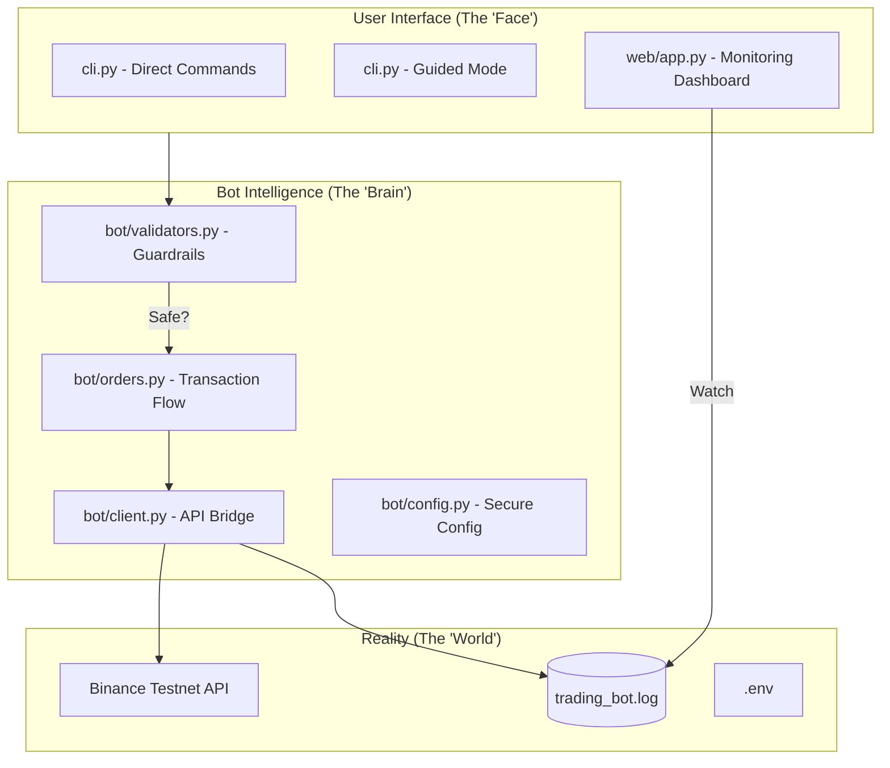

# 🚀 FuturesX-Trader: High-Performance Binance Futures Bot

Welcome to **FuturesX-Trader**. This project isn't just another trading script; it's a carefully architected, production-ready bot built for the **Binance Futures Testnet (USDT-M)**. Whether you're looking to automate basic trades or explore advanced order types with custom leverage, this bot provides the stable foundation you need.

---

## 👨‍💻 Why I Built This (A Note from the Developer)

In the high-stakes world of crypto futures, precision is everything. I designed this bot with a "reliability first" philosophy. Most bots fail because of poor error handling or lack of clear logging—FuturesX-Trader solves this by ensuring every action is validated, logged, and monitored. 

My goal was to create a tool that feels **human**: intuitive CLI prompts, readable logs, and a sleek dashboard so you're never in the dark about your positions.

---

## 🏛️ System Architecture & Design

The bot follows a **Modular Layered Architecture**. I've decoupled the UI from the logic to ensure that adding a new interface (like the Web Dashboard) doesn't break the core trading engine.



---

## 🌟 Key Features

- **🛡️ Guardrail Validation**: Pre-flight checks ensure you never send invalid data to the exchange. Price, quantity, and symbol are all double-checked.
- **🕹️ Interactive Mode**: Not sure about the flags? Use `python cli.py --interactive` for a guided experience.
- **📊 Real-time Dashboard**: A premium FastAPI-powered dashboard helps you visualize your logs in a clean, dark-mode interface.
- **⚙️ Advanced Controls**: Fine-tune your trades with support for **Leverage (1-125x)** and **Margin Types (Isolated/Cross)**.
- **📂 Structured Logging**: No more messy print statements. All movements are recorded in `trading_bot.log` for easy auditing.

---

## 📁 Deep Dive: Project Structure

- **`bot/client.py`**: The "Bridge". It handles the low-level communication with Binance, including leverage updates and margin switching.
- **`bot/validators.py`**: The "Gatekeeper". It contains the logic that keeps your orders sane.
- **`bot/orders.py`**: The "Manager". It coordinates the sequence of events from validation to execution.
- **`web/`**: The "Eyes". A lightweight dashboard to keep you informed without using the terminal.

---

## 🛠️ Quick Start (Get running in 60s)

### 1. The Easy Setup
I've included a `setup.sh` script to handle the boring stuff:
```bash
cd trading_bot
bash setup.sh
```

### 2. Configure Your Keys
Rename `.env.example` to `.env` and drop in your Binance Testnet keys.

### 3. Take a Test Drive
- **Guided Order**: `python cli.py --interactive`
- **Dashboard**: `make ui` (Then visit `http://localhost:8000`)
- **Unit Tests**: `make test`

---

## 📈 Future Roadmap

I'm constantly looking to improve. Some ideas for future versions:
1. **Asynchronous Execution**: Switching to `AsyncClient` for even lower latency.
2. **Strategy Module**: Adding basic SMA/EMA crossover strategies.
3. **Telegram Alerts**: Getting trade notifications directly on your phone.

---

## ⚖️ License
This project is open-source and free to use. Happy trading!
