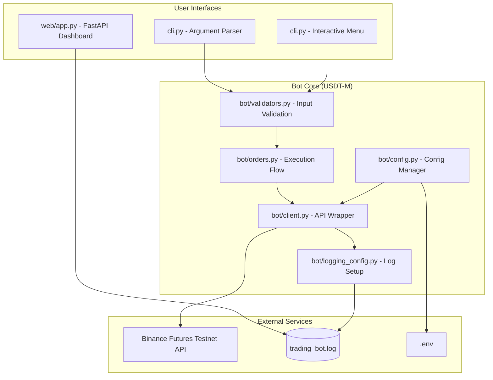

# FuturesX-Trader: Binance Futures Testnet Bot

FuturesX-Trader is a production-grade, modular trading bot designed for the Binance Futures Testnet (USDT-M). It provides a robust architecture for executing **Market**, **Limit**, and **Stop-Limit** orders with advanced controls for **Leverage** and **Margin Management**.

---

## 🏛️ System Architecture

The project follows a clean, decoupled architecture separating the user interface (CLI/Web), business logic, and the API communication layer.



---

## 🚀 Key Features

- **Multi-Interface**: Supports standard CLI flags, an interactive guided menu, and a premium web dashboard.
- **Advanced Order Types**: Handle Market, Limit, and Stop-Limit orders with ease.
- **Risk Management**: Direct support for setting leverage (up to 125x) and switching between Cross and Isolated margin.
- **Robust Validation**: Pre-flight checks for symbol correctness, positive quantities, and required price fields.
- **Comprehensive Logging**: Every API request and response is captured with timestamps in a structured log file.
- **Developer-Friendly**: Includes a full unit test suite and automation via `Makefile` and `setup.sh`.

---

## 📁 Project Structure

```text
trading_bot/
├── bot/                     # Core Business Logic
│   ├── client.py            # High-level Binance API wrapper
│   ├── config.py            # Centralized settings and ENV loading
│   ├── exceptions.py        # Custom trading exceptions
│   ├── logging_config.py    # Dual-output (Console/File) logger
│   ├── orders.py            # Order management & response display
│   └── validators.py        # Input & business rule validation
├── tests/                   # Automated Testing
│   └── test_validators.py   # Unit tests for validation logic
├── web/                     # Monitoring Interface (Bonus)
│   ├── app.py               # FastAPI backend
│   └── templates/           # Premium HTML5 dashboard
├── cli.py                   # Main entry point (Standard & Interactive)
├── Makefile                 # Shortcuts for test/run/ui
├── setup.sh                 # One-click installation script
├── requirements.txt         # Dependency manifest
└── trading_bot.log          # Operational logs
```

---

## 🛠️ Quick Start

### 1. Installation
The fastest way to get started is using the automated setup script:
```bash
cd trading_bot
bash setup.sh
```
This will create a virtual environment, install dependencies, and generate a `.env` template.

### 2. Configuration
Update your `.env` file within the `trading_bot/` directory with your Binance Testnet keys:
```env
BINANCE_API_KEY=your_key
BINANCE_API_SECRET=your_secret
```

### 3. Usage
Within the `trading_bot/` directory:
- **Interactive Mode**: `make run` or `python cli.py --interactive`
- **Market Order**: `python cli.py --symbol BTCUSDT --side BUY --type MARKET --quantity 0.001`
- **Web Dashboard**: `make ui` (Visit http://localhost:8000)
- **Run Tests**: `make test`

---

## 📊 Data Flow

1. **Input**: User provides order details via CLI or Interactive menu.
2. **Validation**: `validators.py` ensures the data is logically sound (e.g., price > 0 for Limit).
3. **Coordination**: `orders.py` wraps the request, preparing logger and UI updates.
4. **Execution**: `client.py` signs the request and sends it to the Binance Testnet.
5. **Logging**: `logging_config.py` captures the JSON response for debugging and auditing.
6. **Monitoring**: The Web Dashboard parses the log file to provide a real-time view of activities.

---

## 🛡️ Error Handling

The bot implements a custom exception hierarchy (`TradingBotError`) to handle:
- **Validation Errors**: Invalid user inputs.
- **API Errors**: Insufficient balance, invalid symbols, or rate limiting.
- **Network Errors**: Connectivity issues using robust handlers in `python-binance`.
